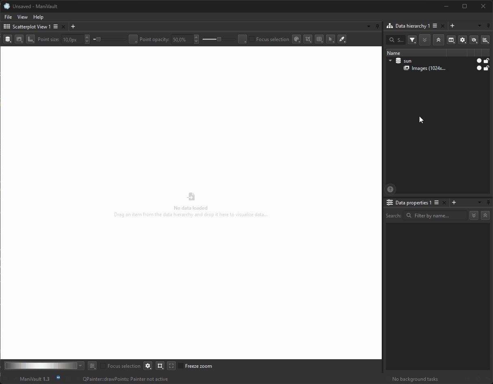

# Dataset drag and drop

Drag and drop lets users connect datasets to a plugin directly from the data hierarchy. `mv::gui::DropWidget` adds this interaction to an existing widget and presents one or more temporary regions describing what a drop will do.



The normal flow is:

1. Enable drops on the target widget and attach a `DropWidget` to it.
2. Inspect the incoming `QMimeData` as `mv::DatasetsMimeData`.
3. Validate the number, type, and state of the dragged datasets.
4. Return regions for the operations that make sense for that drag.
5. Retain dataset handles, update actions, or start work from the selected region's callback.

The callback that supplies regions is a negotiation step, not the place to perform the operation. It runs when a drag enters the target; the selected region's callback runs only when the user drops onto it.

```{toctree}
:maxdepth: 2

accepting_datasets
drop_regions
indicators_and_lifetime
recipes_and_testing
```

For exact signatures, see the {doc}`DropWidget API reference <../../../api/core/gui/widgets/drop_widget>` and {doc}`DatasetsMimeData API reference <../../../api/core/data/datasets_mime_data>`.
