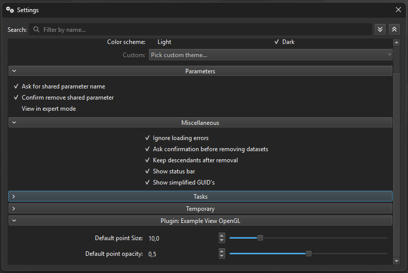

# Plugin-Wide Global Settings

Some plugins expose **global settings** that apply to the plugin as a whole, rather than to individual plugin instances. ManiVault provides a unified mechanism to define, register, display, and persist such settings in a consistent and discoverable way.

This page describes how plugin-wide global settings work, how they are registered, how they are stored, and how to persist plugin settings that are not exposed through the UI.



*The Example View plugin exposes a global default point size and opacity that apply to all Example View instances.*

---

## What are plugin-wide global settings?

Plugin-wide global settings have the following characteristics:

- Shared by **all instances** of a plugin  
- Independent of any specific project, view, or plugin instance  
- Persisted in the application’s **settings store**  
- Exposed automatically in ManiVault’s **global settings UI** (when a UI is provided)

Typical use cases include:
- Default rendering or behavior options  
- Feature toggles  
- Thresholds or limits that apply to all instances  
- Plugin-wide preferences that should persist across application restarts  

The API for plugin global settings is defined on `mv::plugin::PluginFactory` (or a derived factory).

---

## Global settings group action

UI-exposed global settings are defined using a **group action** of type:

```cpp
mv::gui::PluginGlobalSettingsGroupAction
```

This group action contains the individual actions (checkboxes, numeric fields, selectors, etc.) that make up the plugin’s global settings UI.

### Querying the global settings group action

```cpp
mv::gui::PluginGlobalSettingsGroupAction*
mv::plugin::PluginFactory::getGlobalSettingsGroupAction() const;
```

Returns a pointer to the plugin’s global settings group action, or `nullptr` if the plugin does not define global settings.

### Registering the global settings group action

```cpp
void mv::plugin::PluginFactory::setGlobalSettingsGroupAction(
    gui::PluginGlobalSettingsGroupAction* pluginGlobalSettingsGroupAction
);
```

When this function is called:

- The group action is registered with the **ManiVault core**  
- Its contents automatically appear in ManiVault’s **global settings UI**  
- All contained actions are connected to the persistent settings store  

Passing `nullptr` removes the plugin’s global settings from the global settings UI.

```{note}
Plugin developers do not need to manually insert the group action into any UI. Calling `setGlobalSettingsGroupAction()` is sufficient.
```

---

## Settings storage and prefixes

Each plugin’s global settings are stored under a **plugin-specific prefix** in the settings store.

### Global settings prefix

```cpp
QString mv::plugin::PluginFactory::getGlobalSettingsPrefix() const final;
```

This function returns the prefix used to namespace the plugin’s global settings.

The prefix determines:
- Where the settings are stored on disk  
- How settings are isolated between plugins  
- How naming conflicts are avoided  

All actions contained in the global settings group automatically store and retrieve their values under this prefix.

> **Note**  
> The global settings prefix should be treated as **stable API**. Changing it will cause previously stored user settings to be ignored or lost.

---

## Typical setup pattern

Global settings are typically created and registered during plugin or factory initialization.

```cpp
auto globalSettings = new gui::PluginGlobalSettingsGroupAction(
    this,
    "My Plugin Settings"
);

// Add actions to the group
globalSettings->addAction(new gui::BoolAction(this, "Enable feature"));
globalSettings->addAction(new gui::DecimalAction(this, "Global threshold"));

// Register the group action
setGlobalSettingsGroupAction(globalSettings);
```

Once registered:

- The settings appear automatically in ManiVault’s global settings UI  
- Stored values are restored at application startup  
- Changes are persisted automatically by the core  

---

## UI-less persistent plugin settings

Not all plugin settings need to be exposed in the global settings UI. For internal, advanced, or programmatic configuration, plugins can store **persistent settings without UI** using the plugin base class.

The preferred API is:

```cpp
hdps::Plugin::setSetting(const QString& path, const QVariant& value);
hdps::Plugin::getSetting(const QString& path,
                          const QVariant& defaultValue = QVariant());
```

The `path` parameter defines the logical location of the setting. Setting groups are created using forward slashes (`/`).

### Saving a setting

```cpp
plugin->setSetting("General/Computation/NumberOfIterations", 32);
```

### Loading a setting

```cpp
const auto numberOfIterations =
    plugin->getSetting("General/Computation/NumberOfIterations", 32).toInt();
```

These settings:
- Are persisted in the same settings store  
- Are namespaced to the plugin  
- Do not require any UI components  
- Are suitable for internal state, expert options, or algorithm parameters  

---

## Design guidelines

When defining plugin-wide global settings:

- Use global settings **sparingly**; prefer instance-level settings where appropriate  
- Do not store project-specific or view-specific state globally  
- Choose clear, stable names for settings and groups  
- Group related settings logically  
- Assume settings may be modified while plugin instances are active  

---

## Lifecycle considerations

- Global settings typically live for the lifetime of the plugin factory  
- The core handles persistence and UI integration  
- Plugins own the actions and semantics of the settings  
- Removing or renaming settings keys may invalidate existing user preferences  

---

## Summary

- Plugin-wide global settings are exposed via `PluginGlobalSettingsGroupAction`  
- Registering the group action automatically integrates it into ManiVault’s global settings UI  
- Settings are namespaced using a stable plugin-specific prefix  
- Persistence and restoration are handled by the core  
- UI-less persistent settings can be stored directly via the plugin base class  

This approach allows plugins to expose consistent, discoverable, and persistent global configuration without custom UI or storage logic.
