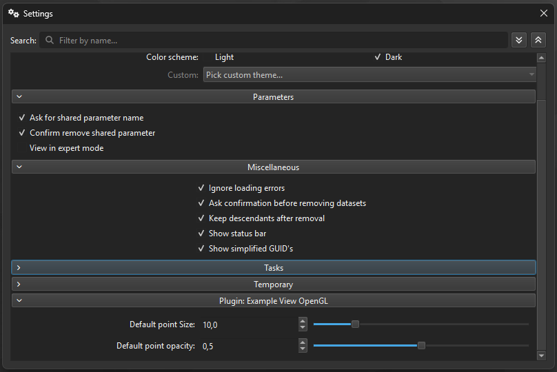

# Global plugin settings

Global plugin settings are application preferences shared by every instance of one plugin kind. Use them for installation-wide defaults and policies that should survive application restarts independently of any project.



The principal UI-backed mechanism is a factory-owned `mv::gui::PluginGlobalSettingsGroupAction`. Its child actions appear in ManiVault's settings dialog and persist their values through the application settings store.

```{important}
Global does not mean project-wide. Opening, saving, or sharing a project should not change another user's application preferences. State belonging to one plugin instance remains project state.
```

```{toctree}
:maxdepth: 2

choosing_a_scope
defining_settings
consuming_settings
persistence_and_compatibility
testing_and_pitfalls
```

For exact signatures, see the {doc}`PluginGlobalSettingsGroupAction API <../../../api/core/gui/actions/grouping/plugin_global_settings_group_action>`, {doc}`PluginFactory API <../../../api/core/plugin/plugin_factory>`, and {doc}`settings manager API <../../../api/core/managers/abstract_settings_manager>`.
