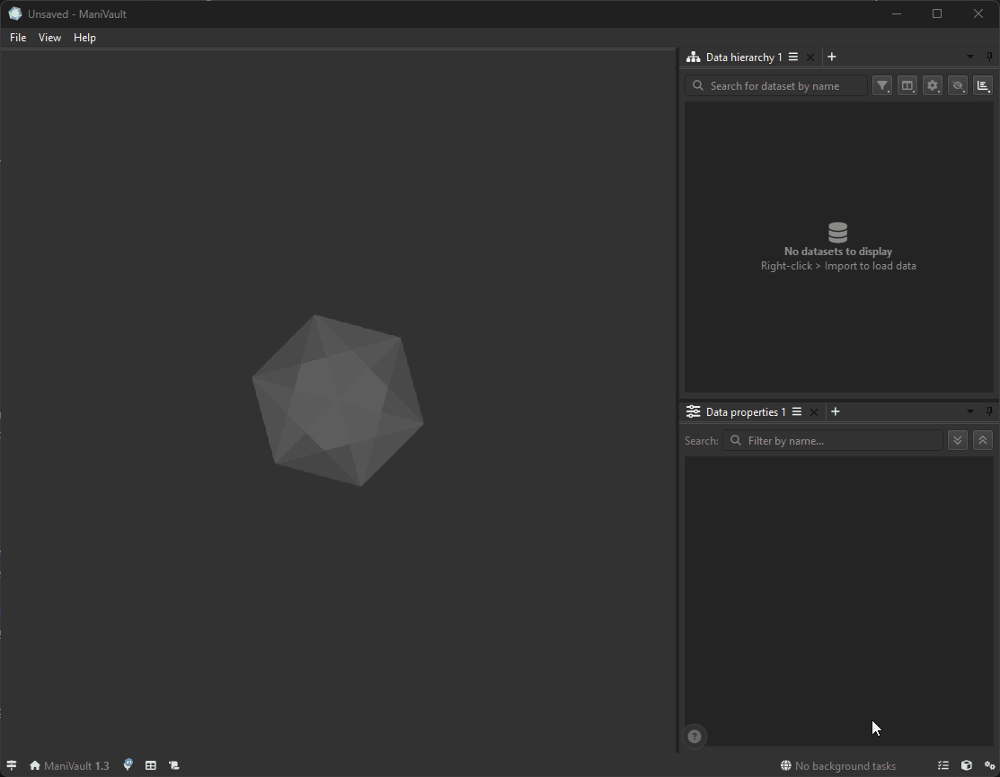

# Learning Center and shortcuts

The Learning Center connects a plugin's user-facing metadata, documentation, tutorials, videos, and shortcut reference to the places where users need them. View plugins receive an in-view overlay; the same global content is also available through ManiVault's Learning Center and Help menu.



Use this section to add discoverable help without implementing custom help menus or dialogs for every view.

```{toctree}
:maxdepth: 1

help_and_metadata
tutorials_and_videos
shortcuts
view_overlay
testing_and_pitfalls
```

## Mental model

| Layer | Responsibility | Ownership |
| --- | --- | --- |
| Global Help manager | Catalogs all tutorials and videos | Owns registered content objects through its models |
| Plugin factory and metadata | Description, about information, repository, README handling, shortcut map | One shared object per plugin kind |
| Plugin instance | Selects relevant tutorials and videos by pointer or tag | Holds non-owning associations |
| View-plugin overlay | Presents relevant help, counts, shortcuts, about information, and links | Created and managed by `ViewPlugin` |

Most plugin code should configure the factory metadata, register stable shortcut descriptions, and associate existing learning content through `getLearningCenterAction()`. The `PluginLearningCenterAction`, overlay widget, dialogs, and catalog models are core-managed implementation details; do not construct replacements unless developing the core itself.

For individual types and member signatures, use the {doc}`Learning Center API reference <../../../api/core/util/learning_center/index>`, {doc}`PluginShortcuts API reference <../../../api/core/plugin/plugin_shortcuts>`, and {doc}`PluginLearningCenterAction API reference <../../../api/core/gui/actions/internal/plugin_learning_center_action>`.
