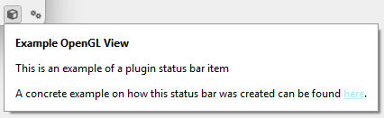

# Status bar integration

Some plugins expose information or controls that are best presented in the **application status bar**. ManiVault provides `PluginStatusBarAction` as a convenience class for integrating plugin-specific status bar actions that automatically react to plugin lifecycle events.

This page explains what a plugin status bar action is, how it behaves, and how it is registered via the plugin factory.



*The [example view GL plugin](https://github.com/ManiVaultStudio/ExamplePlugins/blob/master/ExampleViewOpenGL/src/ExampleViewGLPlugin.cpp) demonstrates the concept of a plugin-specific status bar.*

---

## What is a plugin status bar action?

A **plugin status bar action** is a UI action that appears in the application’s status bar and is associated with a specific plugin kind.

Typical use cases include:
- Displaying plugin-specific state or indicators
- Providing quick access to plugin-related controls
- Showing runtime information relevant to the plugin

Status bar actions are:
- Global to the application
- Associated with a plugin kind, not a specific plugin instance
- Optionally shown only when the plugin is instantiated

---

## Conditional visibility

`PluginStatusBarAction` supports **conditional visibility**, allowing the action to be shown only when at least one instance of the corresponding plugin exists.

By default:
- The action is visible only if one or more plugin instances are loaded.

This avoids cluttering the status bar with actions that are not relevant until a plugin is actually in use.

The visibility condition is reevaluated automatically.

---

## Lifecycle integration

The status bar action integrates with the plugin manager and reacts to plugin lifecycle events:

- When a plugin instance of the associated kind is created
- When a plugin instance of the associated kind is destroyed

On each relevant event, the action reevaluates its visibility. No manual bookkeeping is required by the plugin or application.

---

## Constructor

```cpp
PluginStatusBarAction(
    QObject* parent,
    const QString& title,
    const QString& pluginKind = ""
);
```

Parameters:
- `title` – The label shown in the status bar.
- `pluginKind` – The plugin kind this action is associated with.  
  This value is used to resolve the plugin factory, track instance creation, and derive the plugin icon.

If the plugin factory is already loaded, the action automatically adopts the plugin’s icon.

---

## Visibility logic (conceptual)

- If conditional visibility is enabled:
  - The action is visible only when  
    `getNumberOfInstances() >= 1`
- If conditional visibility is disabled:
  - The action is always visible

This logic is reevaluated when plugin instances are added or removed.

---

## Registering a status bar action

Status bar actions are registered through the plugin factory.

### Plugin factory API

```cpp
gui::PluginStatusBarAction* getStatusBarAction() const;
void setStatusBarAction(gui::PluginStatusBarAction* statusBarAction);
```

### Typical setup

Status bar actions are usually created and registered during plugin factory initialization.

```cpp
auto statusBarAction = new gui::PluginStatusBarAction(
    this,
    "My Plugin Status",
    getKind()
);

setStatusBarAction(statusBarAction);
```

Once registered:
- The action appears in the application’s status bar
- Visibility is managed automatically
- The application does not need to handle plugin lifecycle events manually

Passing `nullptr` to `setStatusBarAction()` removes the plugin’s status bar action.

---

## Design guidelines

When adding a plugin status bar action:

- Keep content lightweight and non-intrusive
- Avoid duplicating full UI panels or dialogs
- Prefer short labels, indicators, or quick toggles
- Use conditional visibility to reduce clutter
- Assume the action may appear and disappear during runtime

---

## Summary

- `PluginStatusBarAction` provides a standardized way to integrate plugin-related UI into the status bar
- Actions can automatically appear only when plugin instances exist
- Visibility reacts to plugin lifecycle events without manual wiring
- Registration is handled through the plugin factory
- This keeps status bar integration consistent, minimal, and maintainable
