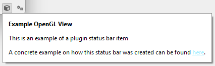

# Status-bar integration

The application status bar is appropriate for compact, persistent information or a small control that remains useful while users work. A plugin factory can register one `mv::gui::PluginStatusBarAction` shared by all instances of its plugin kind.



The action can contain inline child actions, expose a richer popup action, or provide menu commands. `PluginStatusBarAction` additionally supports visibility based on whether its plugin kind has active instances.

```{important}
A plugin status-bar action is factory-wide, not instance-owned. When several instances exist, show aggregate state or provide a way to choose an instance; do not let whichever instance updated last silently represent the whole plugin kind.
```

```{toctree}
:maxdepth: 2

choosing_content
defining_and_registering
content_and_interaction
lifecycle_and_visibility
testing_and_pitfalls
```

For exact signatures, see the {doc}`PluginStatusBarAction API <../../../api/core/gui/actions/miscellaneous/plugin_status_bar_action>`, {doc}`StatusBarAction API <../../../api/core/gui/actions/miscellaneous/status_bar_action>`, and {doc}`StatusAction API <../../../api/core/gui/actions/miscellaneous/status_action>`.
