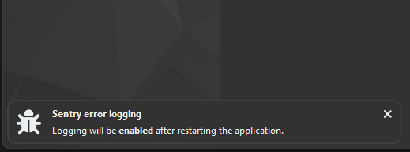

# Notifications
This document describes the two supported ways to send notifications in the plugin system:
a global notification API and a plugin-scoped convenience wrapper.



*Notifications are stacked on top of each other, and disappear automatically.*

---

## Global notification

```cpp
mv::help().addNotification(
    const QString& title,
    const QString& description,
    const StyledIcon& icon,
    util::Notification::DurationType durationType,
    std::int32_t delayMs
);
```

Adds a notification to the main application window.

This function is intended for **global notifications**, independent of any plugin context.

### Parameters

- **`title`**  
  Short notification title displayed prominently.

- **`description`**  
  Detailed notification text. May contain HTML.

- **`icon`**  
  Icon displayed alongside the notification (for example, `"circle-exclamation"`).

- **`durationType`**  
  Controls how long the notification remains visible:
  - `Fixed` — fixed duration
  - `Calculated` — duration based on content length
  - `Task` — remains visible until the associated task completes

- **`delayMs`**  
  Delay in milliseconds before the notification is shown.

### Example

```cpp
mv::help().addNotification(
    "Download problem",
    QStringLiteral("Project not downloaded: %1").arg(errorString),
    StyledIcon("circle-exclamation"),
    util::Notification::DurationType::Fixed,
    0
);
```

---

## Plugin notification (recommended for plugins)

```cpp
void addNotification(
    const QString& description,
    const util::Notification::DurationType& durationType =
        util::Notification::DurationType::Fixed,
    std::int32_t delayMs = 0
) const;
```

Adds a notification originating from a plugin.

Compared to the global notification API, this function automatically derives:

- the notification title from the plugin title
- the notification icon from the plugin metadata

Plugin authors should prefer this function to ensure a consistent user experience.

### Parameters

- **`description`**  
  Message text of the notification. May contain HTML.

- **`durationType`**  
  Duration behavior of the notification:
  - `Fixed`
  - `Calculated`
  - `Task`  
  Defaults to `Fixed`.

- **`delayMs`**  
  Delay in milliseconds before the notification is shown.  
  Defaults to `0`.

### Example

```cpp
addNotification(
    QStringLiteral("Project not downloaded: %1").arg(errorString),
    util::Notification::DurationType::Fixed
);
```
