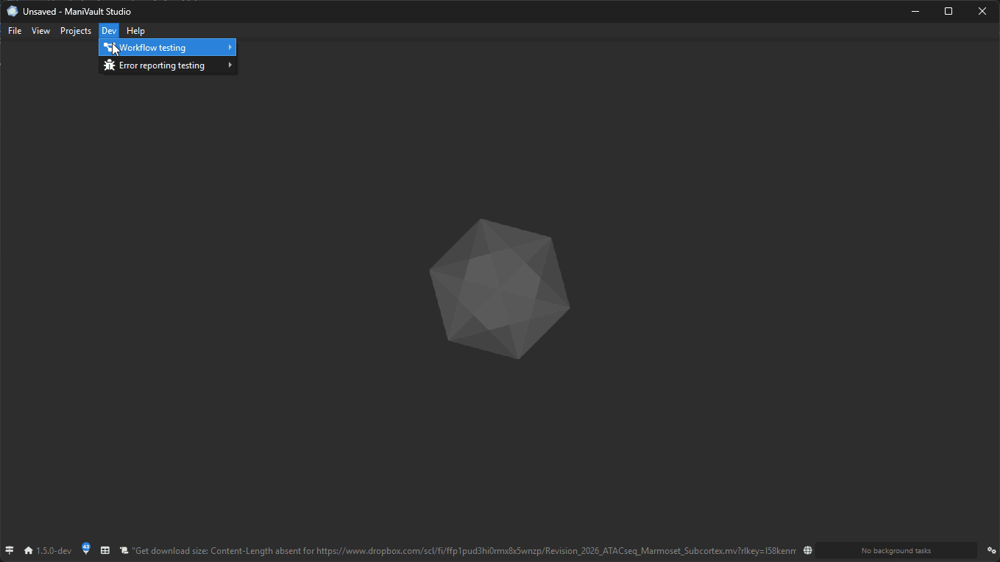

# Parallel execution

Parallel execution is an optional API for scheduling work and running independent operations concurrently. You do not have to use it to build a ManiVault plugin or application. Ordinary synchronous functions, standard action serialization, and other existing Core APIs continue to work without calling `mv::Parallel` or defining a custom workflow.

Use these pages when an operation is substantial enough that moving work to worker threads, processing independent items concurrently, reporting progress, supporting cancellation, or preserving a structured result would improve the implementation or user experience.

## Common recipes

Start with the outcome you need. These links lead to concise recipes with the appropriate API and a small example.

- {ref}`Run one substantial operation on a worker and wait for its result <recipe-run-one-operation>`
- {ref}`Process independent items concurrently <recipe-process-items>`
- {ref}`Transform a collection and preserve input order <recipe-map-results>`
- {ref}`Combine preparation, parallel work, and finalization <recipe-stage-pipeline>`
- {ref}`Limit concurrency or force serial execution <recipe-limit-workers>`
- {ref}`Keep the interface responsive and show live progress <recipe-live-progress>`
- {ref}`Make a long-running operation cancellable <recipe-cancellation>`
- {ref}`Report intermediate progress and diagnostics <recipe-report-progress>`
- {ref}`Prepare on workers and commit on the GUI thread <recipe-gui-commit>`
- {ref}`Process a very large collection in bounded batches <recipe-batched-work>`
- {ref}`Parallelize expensive or staged serialization <recipe-workflow-serialization>`
- {ref}`Show progress for work scheduled by another executor <recipe-external-task>`

Simple action state still uses {doc}`ordinary action serialization <../building_plugins/actions/serialization>`; no parallel API is needed. For tight numerical loops or an already internally threaded kernel, first read {doc}`Intended scope and granularity <scope_and_granularity>`.

## Choose the smallest suitable level

- **Direct synchronous code:** use it when the work is short, bounded, and does not need execution progress or cancellation.
- **High-level `mv::Parallel` utilities:** use them when the caller may wait and the work fits one operation, a collection, a mapping, or a straightforward sequence of stages.
- **Advanced workflow framework:** use it when the operation needs asynchronous lifetime, task-backed progress, cancellation, GUI-thread phases, nesting, custom weights, or detailed reporting.

`mv::Parallel` is the concise entry point when the middle level fits. It builds on the workflow engine without requiring developers to construct workflow plans themselves. Its terminal calls are blocking: the work can run on workflow workers, but the call returns only after the operation finishes. Do not use a blocking helper from a context that must remain responsive.

## Explore the built-in examples

On Windows, ManiVault includes a hidden **Dev** menu with workflow test scenarios. Press `Ctrl+Alt+Shift+D` to reveal the menu, then open **Dev → Workflow testing**. You can run an individual scenario or execute the complete scenario set sequentially.

These scenarios provide a quick way to observe workflow scheduling, progress, reporting, and results in the application. They are demonstrations and integration tests, not setup steps or APIs that plugin code must call.



## Start using the high-level API

Begin with {doc}`Getting started <getting_started>`, then continue with the guide matching the shape of the operation.

```{toctree}
:maxdepth: 1

getting_started
running_operations
processing_collections
mapping_collections
execution_chains
examples
```

## Advanced decisions and controls

The following pages explain configuration, safety, granularity, and the point at which a custom workflow becomes appropriate. They are important when the basic utilities fit only partially, but they are not prerequisites for understanding what the API is for.

```{toctree}
:maxdepth: 1

options_and_cancellation
thread_safety
scope_and_granularity
../workflows/index
```

## API reference

For exact signatures, see the {doc}`parallel API reference <../../api/core/parallel/index>`. The underlying types are documented in the {doc}`workflow API reference <../../api/core/workflow/index>`.
