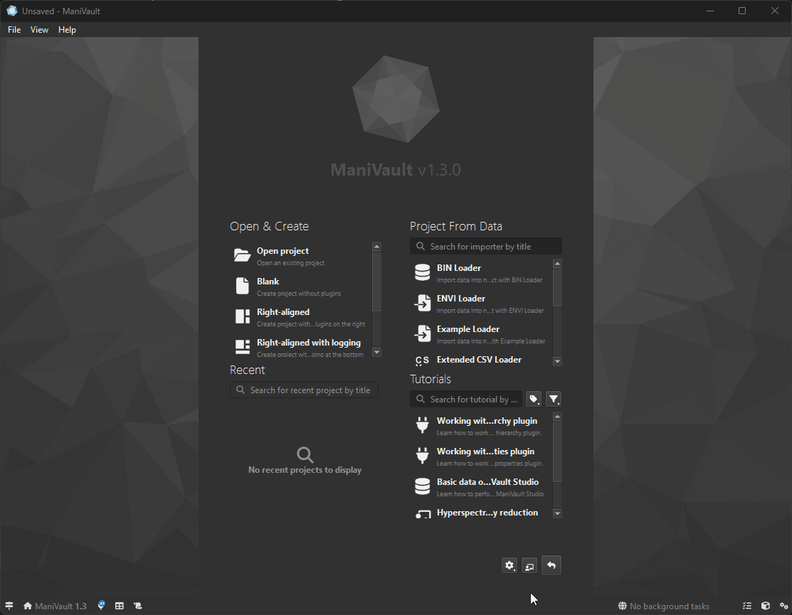
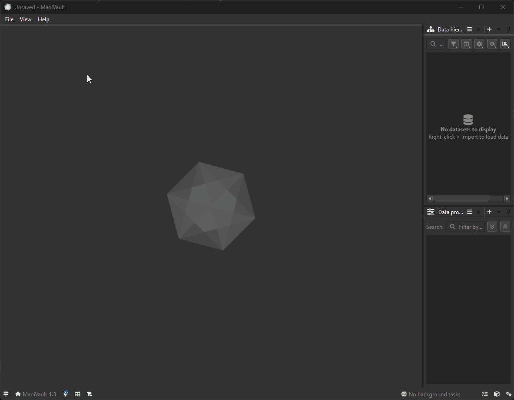
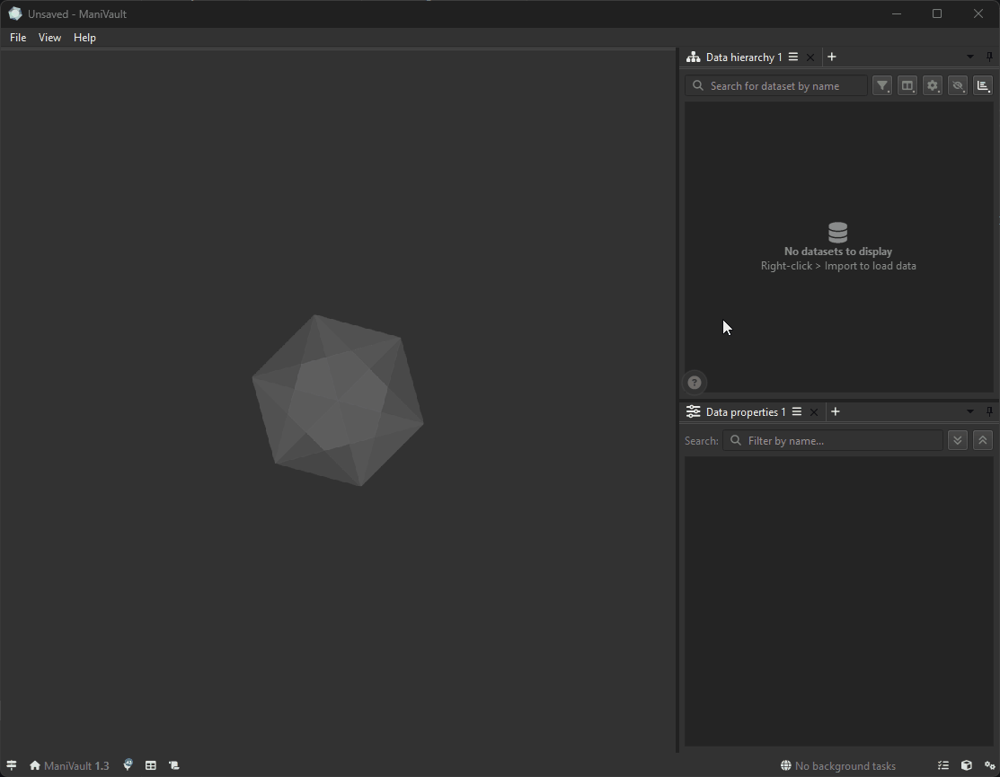
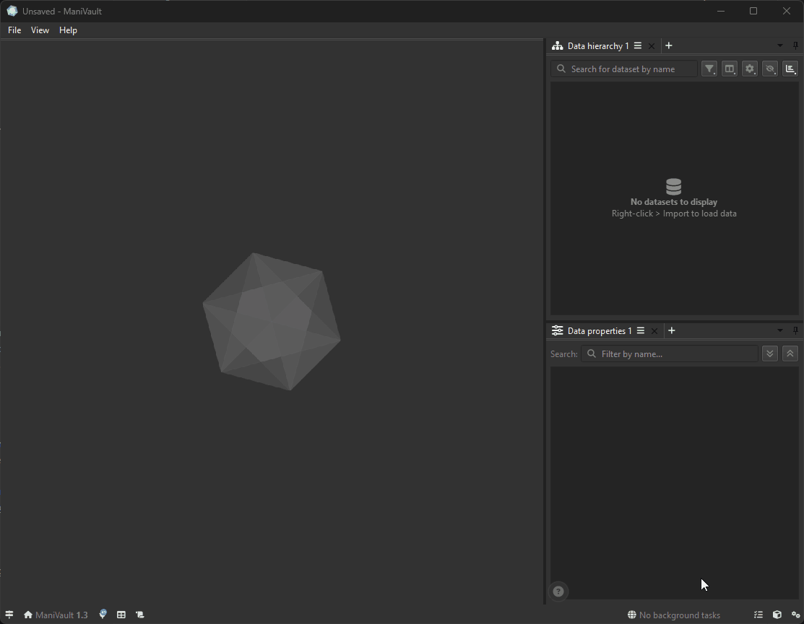
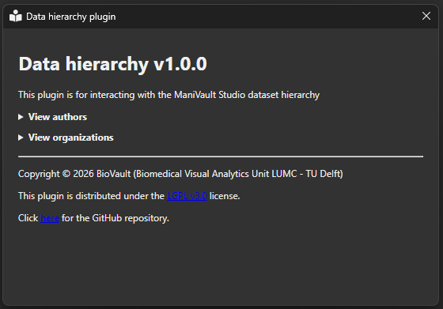
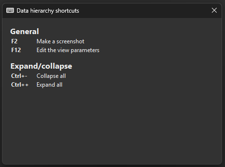

# Onboarding with the learning center
ManiVault contains a comprehensive library of onboarding information for new users such as videos and tutorials. This document is intended to help you understand the learning center so that onboartding becomes as smooth as possible.

```{note}
Plugin developers should consult the [(plugin) learning center API documentation](../development/building_plugins/learning_center.md) if they want to make use of it. 
```
## Global learning center
There is a dedicated **learning center page** which lists all videos and tutorials available in ManiVault. This page can be accessed in three ways:

  
*The welcome page contains a shortcut to the global learning center page.*

  
*The help menu has a shortcut that navigates to the learning center page.*

  
*The plugin learning center contains a shortcut that navigates to the learning center page.*

## Plugin learning center
In addition to the global **learning center**, which contains all tutorials and videos, there is also a **plugin-specific learning center**.

  
*The plugin learning center show plugin-specific onboartding links in a popup.*

Depending on the plugin, the popup might contain:
- **Links to youtube videos**  
Each plugin may provide links to videos demonstrating:
  - Plugin purpose
  - Typical workflows
  - Interactive usage examples
- **Links to tutorials**  
Embedded tutorials which explain:
  - Plugin concepts
  - Step-by-step usage instructions
  - Common workflows and best practices

  These tutorials are optimized for new users and are accessible without leaving the application. Some of the tutorials are accompanied by tutorial projects.
- **Plugin meta data**  
The **plugin learning center** displays metadata for the selected plugin, including:
  - Author names
  - Institutional affiliations
  - Copyright information  
This ensures transparency and proper attribution.

    
  *An example of the plugin meta data dialog.*
- **Shortcuts map**  
A grouped list of plugin-specific shortcuts.  
  
*categorized plugin - example of the plugin meta data dialog.*
- **Link to GitHub repository**  
If available, a direct link to the plugin’s source repository is shown (it will open the default browser window).
This is useful for:
  - Advanced users
  - Developers
  - Inspecting implementation details
  - Reporting issues or contributing
- **Link to the global learning center page**  
When viewing plugin-specific content, a **global learning center** button is available.
This switches the view to a global overview containing:
  - All plugins
  - All tutorials
  - All videos
- **Hide functionality**  
The **hide learning center** button closes the learning center popup.
This allows users to return to their workspace without disabling the feature.
The **learning center** can be reopened at any time.
- **Relocate functionality**  
Users can change the position of the Learning Center popup button.
This allows placing the button on a preferred screen edge to avoid visual clutter.
