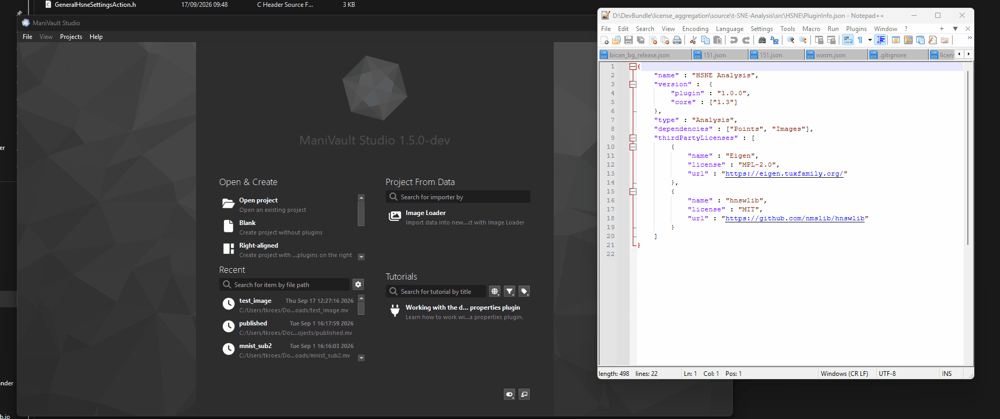

# Viewing third-party licenses

ManiVault shows the licenses declared by ManiVault Core and its available plugins in one searchable view.

*The Help menu's third-party license dialog aggregates Core and plugin dependencies.*

Open the **Help** menu and choose **Third-party licenses**. The dialog groups the aggregated information into Core and plugin dependencies. Use the search field to filter by dependency name or license, and use the **Core** and **Plugins** checkboxes to show or hide each group.

Dependency names link to the URL supplied by the Core or plugin metadata. Follow a link to read the dependency's license or project information. The dialog also has a copy action that places the currently visible license data on the clipboard as indented JSON, which is useful when preparing notices or checking a distribution.

Plugins contribute their entries through the `thirdPartyLicenses` array in `PluginInfo.json`. The list can therefore change when plugins are added, updated, or removed. If an expected dependency is missing, check that the plugin declares its name, license, and URL in `PluginInfo.json` and that the plugin was built with a Core version that supports license aggregation.
